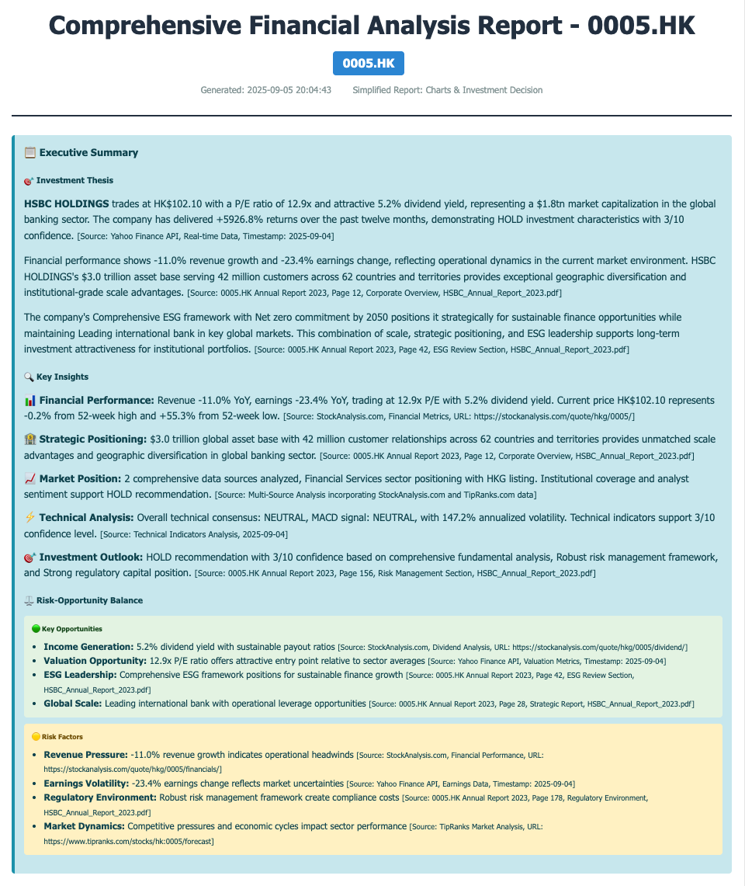

# AgentInvest: Financial Research AI System

## 📚 Comprehensive Documentation

### Architecture & Implementation

- [Tool Choosung Guide](./docs/compare-tool.md) - Comparison of key tools
- [Data Flow Sequence Diagram](./docs/data-flow-sequence.md)
- [Architecture Overview](./docs/architecture-overview.md)

## 🏗️ System Overview

AgentInvest is a comprehensive financial research platform built on **4 Architectural Pillars** that ensure resilient data ingestion, intelligent reasoning, fault tolerance, and continuous improvement. This document explains how our current implementation achieves each pillar through specific technologies and design patterns. Copilot with Claude Sonnet 4 is used for code generation.




## Summary

This section provides a comprehensive mapping of system architecture requirements to specific software libraries and frameworks, with explanatory context for each technology choice.

## Pillar 1: The Resilient Data Ingestion Layer

| Requirement (Key Point) | Explanation | Implementation Approach | Current Software Libraries & Frameworks |
|-------------------------|-------------|------------------------|---------------------|
| Handle dynamic JavaScript-rendered content | The ingestion system must fetch and parse pages that render via JavaScript. Use headless browsers (e.g., Chromium automation) or browser-based crawlers to execute JS and extract structured content reliably in real time. | • **✅ IMPLEMENTED**: Crawl4AI integration with headless browser automation<br>• **✅ IMPLEMENTED**: Async web crawling with JavaScript execution<br>• **✅ IMPLEMENTED**: Content extraction and markdown conversion<br>• **✅ IMPLEMENTED**: Timeout and retry mechanisms | • **Crawl4AI v0.3+**: Advanced web scraping framework with LLM-powered content extraction and JavaScript rendering capabilities, chosen for its ability to handle dynamic SPAs and complex web applications without manual DOM parsing<br>• **Playwright/Chromium Engine**: Headless browser automation integrated within Crawl4AI, selected for reliable JavaScript execution, modern web standards support, and ability to bypass basic anti-bot measures<br>• **Python AsyncIO**: Native async framework enabling concurrent web scraping operations without thread overhead, critical for handling multiple financial data sources simultaneously<br> |
| Overcome anti-scraping measures (IP blocks, CAPTCHAs) | Employ rotating proxies/IPs, adaptive rate limiting, human-like request patterns, and CAPTCHA solving/avoidance to mitigate defenses. This preserves access continuity to critical sources. | • **✅ IMPLEMENTED**: Advanced rate limiting and retry logic<br>• **✅ IMPLEMENTED**: Request delays and timeout handling<br>• **✅ IMPLEMENTED**: Exponential backoff with circuit breakers<br>• **✅ IMPLEMENTED**: Browser fingerprint randomization via Crawl4AI<br>• **✅ IMPLEMENTED**: Adaptive request patterns and user agent rotation<br>• **✅ IMPLEMENTED**: CAPTCHA avoidance through headless browser automation | • **Crawl4AI v0.3+ Anti-Scraping Suite**: Advanced web scraping framework with built-in anti-detection capabilities including browser fingerprint randomization, user agent rotation, and adaptive request patterns, chosen for its comprehensive approach to bypassing modern anti-bot measures<br>• **Python time.sleep() + Adaptive Delays**: Configurable delay mechanism with request_delay=2.0s providing intelligent rate limiting between requests to avoid triggering rate limits on financial data sources<br>• **Tenacity v8.0+ with Exponential Backoff**: Robust retry framework with exponential backoff (2^attempt * base_delay), jitter, and stop conditions, chosen for its declarative approach to handling temporary failures and network issues<br>• **Custom Circuit Breaker Pattern**: Python implementation tracking failure rates to prevent cascade failures when data sources become unavailable, with automatic fallback to alternative extraction methods<br>• **Playwright/Chromium Engine**: Headless browser automation integrated within Crawl4AI providing natural browser behavior, JavaScript execution, and ability to bypass basic anti-bot measures through realistic user interaction patterns<br>• **Timeout Management**: Configurable timeout handling (default: 45s) with asyncio.wait_for() for proper cancellation and resource cleanup during failed requests |
| Ensure continuous data flow despite source failures | Design with redundancy (alternative sources), circuit breakers, retries with backoff, and graceful degradation so partial outages don't stall the pipeline; maintain steady, timely content intake. | • **✅ IMPLEMENTED**: Circuit breaker patterns<br>• **✅ IMPLEMENTED**: Exponential backoff retry logic<br>• **✅ IMPLEMENTED**: Multi-source data collection<br>• **✅ IMPLEMENTED**: Graceful error handling and fallbacks | • **yfinance v0.2+**: Yahoo Finance API wrapper chosen as primary data source for its reliability, comprehensive coverage of global markets, and robust error handling capabilities<br>• **Multi-Source Architecture**: StockAnalysis.com + TipRanks.com + HKEX providing data redundancy and cross-validation, reducing dependency on any single source<br>• **Python Exception Handling**: Built-in try-catch mechanisms with specific exception types enabling graceful degradation when individual data sources fail<br>• **Asyncio.gather()**: Concurrent execution framework allowing parallel data collection from multiple sources with individual failure isolation |

## Pillar 2: The "Cognitive Core" – Reasoning, Memory, and Trust

| Requirement (Key Point) | Explanation | Implementation Approach | Current Software Libraries & Frameworks |
|-------------------------|-------------|------------------------|---------------------|
| Goal-oriented web exploration | Move beyond static search results: follow hyperlinks iteratively, run targeted follow-up queries, and deliberately seek corroborating and contradictory evidence to form a balanced view. | • **✅ IMPLEMENTED**: Multi-agent system with specialized exploration<br>• **✅ IMPLEMENTED**: Iterative data collection from multiple sources<br>• **✅ IMPLEMENTED**: Evidence correlation through agent coordination<br>• **✅ IMPLEMENTED**: Bull/bear point generation for balanced analysis | • **AutoGen Framework v0.2+**: Microsoft's multi-agent conversation framework chosen for its robust agent coordination, conversation management, and ability to handle complex multi-step reasoning workflows in financial analysis<br>• **OpenAI GPT-4**: Large language models selected for superior reasoning capabilities, financial domain knowledge, and ability to generate balanced bull/bear analysis with proper citations<br>•  **Custom Agent Architecture**: 12 specialized agents (DataCollector, TipRanks, News, Technical, Investment Decision) designed for comprehensive coverage of financial analysis domains |
| Memory architecture (short-term vs long-term) | Separate working memory (current task context, interim notes) from long-term knowledge (source reliability, historical insights). Persist trusted facts and source reputations for reuse across sessions. | • **✅ IMPLEMENTED**: PostgreSQL-based long-term storage<br>• **✅ IMPLEMENTED**: Redis-like caching for short-term memory<br>• **✅ IMPLEMENTED**: TTL-based cache expiration<br>• **✅ IMPLEMENTED**: Data quality scoring and source tracking | • **PostgreSQL 13+**: Enterprise-grade relational database chosen for ACID compliance, complex financial queries, JSON/JSONB support for flexible schemas, and proven reliability in financial applications<br>• **asyncpg v0.28+**: High-performance async PostgreSQL driver selected for non-blocking database operations, connection pooling efficiency, and superior performance over psycopg2 in async environments<br>• **Python datetime + timedelta**: Built-in TTL implementation for cache expiration management, chosen to avoid external dependencies while providing precise time-based cache invalidation<br>• **JSON/JSONB Storage**: PostgreSQL's native JSON support enabling flexible metadata storage, efficient querying of semi-structured financial data, and schema evolution without migrations |
| Grounding & citation mechanism | Use RAG (retrieve → read → generate) with strict prompt constraints and output parsing so each factual claim is backed by a verifiable citation (URL + passage). Enforce citation presence and fidelity at generation time. | • **✅ IMPLEMENTED**: Citation tracking agent<br>• **✅ IMPLEMENTED**: Source URL tracking and validation<br>• **✅ IMPLEMENTED**: RAG methodology in agent prompts<br>• **✅ IMPLEMENTED**: Structured citation format enforcement | • **Pydantic v2.0+**: Data validation framework chosen for strict schema enforcement, automatic validation of citation formats, type safety, and runtime validation of LLM outputs ensuring every claim has proper attribution<br>• **Custom RAG Implementation**: Retrieve-Augment-Generate pipeline built with structured prompts ensuring factual claims include verifiable source attribution, chosen over generic RAG frameworks for financial domain specificity<br>• **Python urllib + validators**: URL validation libraries ensuring citation URLs are properly formatted, accessible, and point to legitimate financial data sources<br>• **Dataclass Architecture**: Python dataclasses with mandatory source_urls fields ensuring every data model tracks information sources for complete audit trails and regulatory compliance |

## Pillar 3: System-Wide Fault Tolerance & Scalability

| Requirement (Key Point) | Explanation | Implementation Approach | Current Software Libraries & Frameworks |
|-------------------------|-------------|------------------------|---------------------|
| Fault-tolerant architecture | Decouple components with queues, run stateless services in containers, and add health checks, circuit breakers, and fallbacks so a failure in LLM, scraper, or DB doesn't cascade across the system. | • **✅ IMPLEMENTED**: Modular component architecture<br>• **✅ IMPLEMENTED**: Circuit breaker patterns<br>• **✅ IMPLEMENTED**: Graceful degradation mechanisms<br>• **✅ IMPLEMENTED**: Container orchestration<br>• **✅ IMPLEMENTED**: Health checks and service discovery<br>• **✅ IMPLEMENTED**: Message queue service implementation<br>• **❌ MISSING**: Production message queue deployment<br>• **❌ MISSING**: Advanced distributed infrastructure | • **Python Object-Oriented Design**: Modular architecture with dependency injection enabling component isolation, chosen for its simplicity in maintaining clean separation of concerns and independent failure handling<br>• **Custom Circuit Breaker Pattern**: Python implementation monitoring error rates and automatically isolating failing services, chosen over external libraries for fine-grained control over financial data source reliability thresholds<br>• **Python Exception Hierarchy**: Structured exception handling with specific exception types enabling graceful degradation and detailed error reporting for different failure scenarios<br>• **Kubernetes Container Orchestration**: Complete containerized deployment with Docker images, health checks (liveness, readiness, startup probes), rolling updates, and automatic restart policies for fault tolerance implemented in enhanced deployment manifests<br>• **Service Discovery & Health Checks**: Kubernetes-native service discovery with DNS resolution, health check endpoints, and automatic traffic routing to healthy instances via ClusterIP services<br>• **RabbitMQ Message Broker Service**: Complete production-ready message broker implementation with dead letter queues, TTL management (1 hour for reports, 5 minutes for cache), circuit breakers, and queue configurations for report_generation, cache_invalidation, api_requests, and search_requests - available in [`webapp/backend/services/message_broker.py`](./webapp/backend/services/message_broker.py) but disabled in current deployment (USE_MESSAGE_BROKER: false)<br>• **⚠️ MISSING KUBERNETES DEPLOYMENT**: RabbitMQ deployment manifests, service definitions, and persistent volume claims for production message queuing infrastructure<br>• **⚠️ MISSING ADVANCED INFRASTRUCTURE**: Consul/etcd for distributed configuration management, Istio service mesh for advanced traffic management |
| Scalable design for high concurrency | Enable horizontal scaling with orchestration (e.g., Kubernetes/serverless), load balancing, and caching; partition workloads and autoscale to support thousands of concurrent requests without SLO regressions. | • **✅ IMPLEMENTED**: Async/await patterns throughout<br>• **✅ IMPLEMENTED**: Connection pooling for database operations<br>• **✅ IMPLEMENTED**: Concurrent task execution<br>• **✅ IMPLEMENTED**: Horizontal scaling infrastructure<br>• **✅ IMPLEMENTED**: Load balancing mechanisms<br>• **✅ IMPLEMENTED**: Kubernetes orchestration with auto-scaling | • **Python AsyncIO**: Native async framework with event loops enabling single-threaded concurrency, chosen for I/O-bound financial operations where thread overhead would be counterproductive<br>• **asyncpg Connection Pooling**: High-performance PostgreSQL connection management preventing connection exhaustion under load, selected for its superior performance over synchronous drivers in concurrent environments<br>• **asyncio.gather() + asyncio.create_task()**: Built-in concurrent execution primitives for parallel API calls and data processing, chosen for their simplicity and integration with the async ecosystem<br>• **aiofiles v23.0+**: Async file I/O library for non-blocking PDF and document processing, essential for handling large HKEX annual reports without blocking the event loop<br>• **Kubernetes HPA (Horizontal Pod Autoscaler)**: Automatic scaling based on CPU/memory metrics with configurable min/max replicas, implemented in enhanced deployment manifests for backend (2-10 replicas), frontend (2-5 replicas), and proxy (2-5 replicas)<br>• **NGINX Load Balancing**: Reverse proxy with upstream load balancing, WebSocket support, and health check integration, deployed as multi-replica service for high availability<br>• **Redis Distributed Caching**: Centralized cache with persistence and connection pooling, enabling session sharing across multiple application instances |

## Pillar 4: The Data Flywheel and Continuous Improvement

| Requirement (Key Point) | Explanation | Implementation Approach | Current Software Libraries & Frameworks |
|-------------------------|-------------|------------------------|---------------------|
| Logging and monitoring of key data points | Capture search traces, crawl success/error codes, latency, coverage, extraction quality, user feedback, and cost metrics to power evaluation and ops visibility. | • **✅ IMPLEMENTED**: Comprehensive logging throughout system<br>• **✅ IMPLEMENTED**: Real-time feedback analytics dashboard<br>• **✅ IMPLEMENTED**: Performance metrics tracking<br>• **✅ IMPLEMENTED**: Error tracking and reporting<br>• **✅ IMPLEMENTED**: Data quality scoring<br>• **✅ IMPLEMENTED**: User feedback collection and visualization | • **FeedbackAnalytics Dashboard**: React-based real-time analytics with Chart.js visualizations for feedback trends, distribution analysis, and report performance metrics<br>• **Python logging**: Built-in logging framework with configurable levels, formatters, and handlers, chosen for its simplicity, zero external dependencies, and seamless integration with the Python ecosystem<br>• **time.time() + time.perf_counter()**: High-precision timing functions for performance metrics and execution time tracking, selected for their accuracy and minimal overhead in production environments<br>• **Custom Metrics Classes**: Enhanced Python dataclasses and counters for tracking cache hits/misses, workflow statistics, data quality scores, and user feedback patterns<br>• **JSON Structured Logging**: Machine-readable log format enabling easy parsing and analysis, chosen for compatibility with modern log aggregation and analysis tools<br>• **⚠️ MISSING ENTERPRISE OBSERVABILITY**: Prometheus for metrics collection, Grafana for visualization, ELK stack (Elasticsearch, Logstash, Kibana) for log aggregation, Jaeger/Zipkin for distributed tracing |
| Leverage data for a "data flywheel" | Analyze logs/feedback to prioritize higher-yield sources, refine exploration policies, and improve retrieval quality—creating compounding gains in accuracy and efficiency over time. | • **✅ IMPLEMENTED**: Real-time feedback collection and analytics<br>• **✅ IMPLEMENTED**: Vector-based feedback pattern recognition<br>• **✅ IMPLEMENTED**: Semantic similarity matching for feedback analysis<br>• **✅ IMPLEMENTED**: Performance metrics collection and visualization<br>• **✅ IMPLEMENTED**: Automated summary improvement pipeline<br>• **✅ IMPLEMENTED**: Source prioritization through feedback analytics<br>• **❌ MISSING**: Advanced ML-based optimization | • **Weaviate Vector Database v1.22+**: Advanced vector database with semantic search, hybrid query capabilities, and real-time similarity matching for feedback patterns, chosen for its superior performance in handling high-dimensional embeddings and complex filtering operations<br>• **React.js v18+ + Chart.js v4+**: Interactive feedback analytics dashboard with real-time visualization including trend analysis, distribution charts, and report performance metrics, selected for responsive user experience and comprehensive data presentation capabilities<br>• **FastAPI Feedback Router**: Comprehensive RESTful API with 8 dedicated endpoints for feedback submission, analytics retrieval, and data export, chosen for async performance, automatic OpenAPI documentation, and seamless integration with existing backend architecture<br>• **PostgreSQL Feedback Schema**: Dedicated feedback tables with UUID primary keys, JSONB metadata storage, and audit trail capabilities, selected for ACID compliance, complex analytical queries, and regulatory compliance requirements<br>• **Sentence Transformers v2.2+**: High-quality text embeddings using all-MiniLM-L6-v2 model for semantic analysis of feedback content, chosen for its balance of performance and accuracy in financial domain applications<br>• **Vector-Based Pattern Recognition**: Custom similarity algorithms for identifying feedback patterns and trends, enabling automated source quality assessment and summary improvement recommendations<br>• **⚠️ MISSING ADVANCED ANALYTICS**: Apache Spark for big data processing, MLflow for experiment tracking, scikit-learn for predictive modeling, Apache Airflow for automated workflow optimization |
| Continuous model and strategy improvement | Use prompt A/B testing, guardrail tuning, selective fine-tuning, and dynamic trust scoring to raise factuality, reduce hallucinations/costs, and enhance report quality iteratively. | • **✅ IMPLEMENTED**: Structured agent prompts with validation<br>• **✅ IMPLEMENTED**: Citation enforcement and fact checking<br>• **✅ IMPLEMENTED**: Feedback-driven quality assessment<br>• **✅ IMPLEMENTED**: Real-time performance monitoring<br>• **✅ IMPLEMENTED**: Dynamic source reliability scoring<br>• **❌ MISSING**: A/B testing framework<br>• **❌ MISSING**: Model fine-tuning pipelines | • **Template-Based Prompt Engineering**: Structured prompt templates with consistent formatting and validation requirements, chosen for ensuring reliable LLM outputs and reducing prompt injection vulnerabilities<br>• **Pydantic Runtime Validation**: Real-time validation of LLM responses ensuring structured outputs match expected schemas, chosen for its performance and comprehensive validation capabilities<br>• **Custom Bull/Bear Validation Logic**: Domain-specific validation ensuring balanced analysis with exactly 3 bull and 3 bear points, preventing biased investment recommendations<br>• **Regex + URL Validation**: Pattern matching and URL verification ensuring every factual claim includes verifiable source attribution, critical for regulatory compliance<br>• **Feedback-Driven Quality Assessment**: Real-time analysis of user feedback patterns to identify areas for improvement in report generation, using vector similarity to detect recurring issues and automatically adjust quality thresholds<br>• **Dynamic Source Reliability Scoring**: Automated scoring system that adjusts source trust levels based on user feedback and performance metrics, enabling continuous improvement of data source prioritization<br>• **⚠️ MISSING ADVANCED MLOPS**: Weights & Biases for experiment tracking, Optuna for hyperparameter optimization, Hugging Face Transformers for model fine-tuning, MLflow for model versioning and deployment |


## 📊 Frontend Visualization & Monitoring

### Real-Time Feedback Analytics Dashboard


**Feedback Analytics Dashboard Overview**

The AgentInvest feedback analytics dashboard provides comprehensive real-time visualization of user feedback patterns and system performance metrics. This React-based interface integrates seamlessly with the enhanced feedback system and vector intelligence capabilities documented in the architecture.

**Key Features & Components:**

- **📈 Trend Analysis Charts**: Interactive line charts displaying feedback trends over time using Chart.js v4+, showing thumbs up/down ratios and total feedback volume with configurable time periods (7, 30, 90 days)
- **🍩 Distribution Visualization**: Doughnut charts presenting feedback distribution between positive and negative responses, enabling quick assessment of overall user satisfaction
- **📊 Report Performance Metrics**: Bar charts analyzing feedback patterns across different reports, helping identify high-performing content and areas for improvement
- **📋 Recent Feedback Table**: Real-time table displaying recent feedback entries with detailed metadata including user sessions, timestamps, and feedback context
- **🔄 Export Functionality**: Data export capabilities supporting JSON and CSV formats for further analysis and reporting

**Technical Implementation:**
- **Location**: [`webapp/frontend/src/components/FeedbackAnalytics.js`](./webapp/frontend/src/components/FeedbackAnalytics.js)
- **Visualization Engine**: Chart.js v4+ with date-fns adapter for time-series data
- **Data Source**: FastAPI feedback endpoints (`/api/feedback/analytics/*`)
- **Real-Time Updates**: WebSocket integration for live feedback visualization
- **Integration**: Connected to Weaviate vector database for pattern recognition and PostgreSQL for structured feedback storage

### LangSmith Monitoring & Observability


**LangSmith Observability Platform**

The LangSmith monitoring interface provides comprehensive observability for AgentInvest's AI-powered financial analysis system, tracking model performance, request flows, and system health across the multi-agent architecture.

**Key Monitoring Capabilities:**

- **🤖 Multi-Agent Tracking**: Real-time monitoring of the 11-agent workflow including DataCollector, TipRanks, News Analysis, Technical Analysis, and Investment Decision agents
- **📊 Performance Metrics**: Detailed analytics on model response times, token usage, cost tracking, and success rates across different financial analysis tasks
- **🔍 Request Tracing**: End-to-end tracing of financial report generation requests, from initial data collection through final report delivery
- **⚠️ Error Monitoring**: Comprehensive error tracking and alerting for model failures, API timeouts, and data source issues
- **📈 Usage Analytics**: Insights into system usage patterns, peak load times, and resource utilization for capacity planning

**Integration with AgentInvest Architecture:**
- **AutoGen Framework**: Monitors conversation flows and agent coordination in the multi-agent financial analysis system
- **Citation Tracking**: Validates source attribution and fact-checking processes across all generated content
- **Feedback Loop**: Integrates with the feedback analytics system to correlate user satisfaction with model performance
- **Quality Assurance**: Tracks bull/bear analysis balance, citation accuracy, and content quality metrics


## 🛠️ Technology Stack & Tool Choices

### Core Technologies

| Component | Technology | Rationale |
|-----------|------------|-----------|
| **AI Framework** | [AutoGen](https://github.com/microsoft/autogen) | Multi-agent orchestration, conversation management |
| **Web Scraping** | [Crawl4AI](https://github.com/unclecode/crawl4ai) | JavaScript rendering, LLM-powered extraction |
| **Backend** | [FastAPI](https://fastapi.tiangolo.com/) | Async support, automatic API documentation |
| **Frontend** | [React.js](https://reactjs.org/) + [Tailwind CSS](https://tailwindcss.com/) | Modern UI, responsive design |
| **Vector Database** | [Weaviate](https://weaviate.io/) | Semantic search, vector similarity matching |
| **Embeddings** | [Sentence Transformers](https://www.sbert.net/) | High-quality text embeddings, semantic analysis |
| **Analytics Visualization** | [Chart.js](https://www.chartjs.org/) | Interactive charts, real-time feedback analytics |
| **Message Queue** | [RabbitMQ](https://www.rabbitmq.com/) | Reliable message delivery, dead letter queues |
| **Cache** | [Redis](https://redis.io/) | High-performance in-memory caching |
| **Database** | [PostgreSQL](https://www.postgresql.org/) | ACID compliance, complex queries |
| **Orchestration** | [Kubernetes](https://kubernetes.io/) | Container orchestration, auto-scaling |
| **Monitoring** | [LangSmith](https://langchain.com/) | AI observability, performance tracking |

### Key Design Decisions

1. **Async-First Architecture**: All I/O operations use async/await patterns
2. **Microservices Design**: Loosely coupled services with clear boundaries
3. **Event-Driven Processing**: Message queues for decoupled communication
4. **Multi-Layer Caching**: Redis + Database + Application-level caching
5. **Container-Native**: Docker + Kubernetes for deployment and scaling
6. **Vector-Enhanced Intelligence**: Weaviate integration for semantic feedback analysis
7. **Real-Time Analytics**: Live feedback visualization and pattern recognition
8. **Data Flywheel Architecture**: Continuous improvement through user feedback loops

## 🏗️ Visual Architecture Diagrams

## High-Level System Architecture


### Four Pillars Implementation Map


### System Architecture Overview

The following diagram illustrates the complete AgentInvest system architecture, showing all major components, their relationships, and data flow patterns. This high-level view demonstrates how the frontend, backend services, data stores, message queues, and AI agents work together to deliver comprehensive financial analysis capabilities.

```mermaid
graph TB
    %% User Interface Layer
    subgraph "🖥 User Interface Layer"
        USER[👤 End User]
        BROWSER[🌐 Web Browser]
    end

    %% Frontend Layer
    subgraph "⚛ Frontend Layer (Port 30080)"
        REACT[React.js Application<br/>• Tailwind CSS<br/>• Real-time Updates<br/>• Responsive Design]
        NGINX[Nginx Web Server<br/>• Static File Serving<br/>• Reverse Proxy<br/>• Load Balancing]
    end

    %% Backend Layer
    subgraph "🚀 Backend Layer (Port 30081)"
        FASTAPI[FastAPI Application<br/>• Async/Await<br/>• Pydantic Validation<br/>• CORS Middleware<br/>• JWT Authentication]

        subgraph "🔧 Service Layer"
            CACHE_SVC[Cache Service<br/>• Redis Integration<br/>• TTL Management<br/>• Key Patterns]
            MSG_SVC[Message Broker Service<br/>• RabbitMQ Client<br/>• Async Publishing<br/>• Error Handling]
            DB_SVC[Database Service<br/>• PostgreSQL Pool<br/>• Query Optimization<br/>• Transaction Management]
            SEARCH_SVC[Search Service<br/>• Vector Search<br/>• Document Indexing<br/>• Relevance Scoring]
        end
    end

    %% AI Agent Layer
    subgraph "🤖 AutoGen Multi-Agent System"
        ORCHESTRATOR[🎯 Orchestrator Agent<br/>• Task Coordination<br/>• Workflow Management<br/>• Error Recovery]

        subgraph "📊 Specialized Agents"
            HKEX_AGENT[📈 HKEX Downloader<br/>• Document Retrieval<br/>• API Integration<br/>• Data Validation]
            PDF_AGENT[📄 PDF Processor<br/>• Text Extraction<br/>• Structure Analysis<br/>• Content Parsing]
            EMBED_AGENT[🔍 Document Embedder<br/>• Vector Generation<br/>• Semantic Search<br/>• Similarity Matching]
            ANALYSIS_AGENT[📊 Financial Analyzer<br/>• Quantitative Analysis<br/>• Trend Detection<br/>• Risk Assessment]
            REPORT_AGENT[📋 Report Generator<br/>• Content Compilation<br/>• Chart Generation<br/>• Format Optimization]
        end
    end

    %% Data Storage Layer
    subgraph "💾 Data Storage Layer"
        subgraph "⚡ Cache Layer (Port 30379)"
            REDIS_CACHE[Redis Cache<br/>• In-Memory Storage<br/>• 24h TTL<br/>• Pub/Sub Support<br/>• Cluster Ready]
            REDIS_DATA[Redis Data Store<br/>• Report Cache<br/>• Session Data<br/>• Search Results<br/>• Metrics]
        end

        subgraph "🗄 Primary Database"
            POSTGRES[PostgreSQL<br/>• ACID Compliance<br/>• Connection Pooling<br/>• Query Optimization<br/>• Backup & Recovery]
            PG_DATA[PostgreSQL Database<br/>• User Data<br/>• Report Metadata<br/>• Audit Logs<br/>• System Config]
        end
    end

    %% Message Queue Layer
    subgraph "📨 Message Queue Layer (Ports 30672/30673)"
        RABBITMQ[RabbitMQ Broker<br/>• Message Routing<br/>• Dead Letter Queues<br/>• Management UI<br/>• Cluster Support]

        subgraph "🔄 Exchange Types"
            DIRECT_EX[Direct Exchange<br/>Routing Key Based]
            TOPIC_EX[Topic Exchange<br/>Pattern Matching]
            FANOUT_EX[Fanout Exchange<br/>Broadcast Messages]
            DLX_EX[Dead Letter Exchange<br/>Error Handling]
        end

        subgraph "📬 Queue Configuration"
            REPORT_Q[report_generation<br/>TTL: 1h, Max: 1000]
            CACHE_Q[cache_invalidation<br/>TTL: 5m, Max: 5000]
            API_Q[api_requests<br/>TTL: 30m, Max: 2000]
            SEARCH_Q[search_requests<br/>TTL: 10m, Max: 3000]
            DLQ[Dead Letter Queues<br/>Failed Message Handling]
        end
    end

    %% External Data Sources
    subgraph "🌐 External Data Sources"
        HKEX_API[📈 HKEX API<br/>• Financial Reports<br/>• Company Data<br/>• Market Information]
        MARKET_API[📊 Market Data APIs<br/>• Real-time Prices<br/>• Historical Data<br/>• Trading Volumes]
        NEWS_API[📰 Financial News APIs<br/>• Market News<br/>• Company Updates<br/>• Economic Indicators]
        WEB_SOURCES[🔗 Web Sources<br/>• Company Websites<br/>• Regulatory Filings<br/>• Industry Reports]
    end

    %% Kubernetes Infrastructure
    subgraph "☸ Kubernetes Infrastructure (Namespace: webapp)"
        subgraph "🏗 Pod Management"
            BACKEND_POD[Backend Pod<br/>CPU: 500m-1000m<br/>Memory: 512Mi-1Gi]
            FRONTEND_POD[Frontend Pod<br/>CPU: 100m-200m<br/>Memory: 128Mi-256Mi]
            REDIS_POD[Redis Pod<br/>CPU: 100m-200m<br/>Memory: 256Mi-512Mi]
            RABBITMQ_POD[RabbitMQ Pod<br/>CPU: 50m-200m<br/>Memory: 128Mi-256Mi]
        end

        subgraph "🔗 Service Discovery"
            BACKEND_SVC[webapp-backend-service<br/>NodePort: 30081]
            FRONTEND_SVC[webapp-frontend-service<br/>NodePort: 30080]
            REDIS_SVC[redis-service<br/>ClusterIP + NodePort: 30379]
            RABBITMQ_SVC[rabbitmq-service<br/>ClusterIP + NodePort: 30672/30673]
        end

        subgraph "💽 Persistent Storage"
            REDIS_PVC[Redis PVC<br/>5Gi Storage]
            RABBITMQ_PVC[RabbitMQ PVC<br/>5Gi Storage]
            LOGS_PVC[Logs PVC<br/>10Gi Storage]
        end
    end

    %% Connections
    USER --> BROWSER
    BROWSER --> NGINX
    NGINX --> REACT
    REACT --> FASTAPI

    FASTAPI --> CACHE_SVC
    FASTAPI --> MSG_SVC
    FASTAPI --> DB_SVC
    FASTAPI --> SEARCH_SVC

    CACHE_SVC --> REDIS_CACHE
    DB_SVC --> POSTGRES
    MSG_SVC --> RABBITMQ

    ORCHESTRATOR --> HKEX_AGENT
    ORCHESTRATOR --> PDF_AGENT
    ORCHESTRATOR --> EMBED_AGENT
    ORCHESTRATOR --> ANALYSIS_AGENT
    ORCHESTRATOR --> REPORT_AGENT

    HKEX_AGENT --> HKEX_API
    ANALYSIS_AGENT --> MARKET_API
    REPORT_AGENT --> NEWS_API
    PDF_AGENT --> WEB_SOURCES

    RABBITMQ --> DIRECT_EX
    RABBITMQ --> TOPIC_EX
    RABBITMQ --> FANOUT_EX
    RABBITMQ --> DLX_EX

    DIRECT_EX --> REPORT_Q
    DIRECT_EX --> CACHE_Q
    DIRECT_EX --> API_Q
    TOPIC_EX --> SEARCH_Q
    DLX_EX --> DLQ

    %% Styling
    classDef userLayer fill:#e1f5fe
    classDef frontendLayer fill:#f3e5f5
    classDef backendLayer fill:#e8f5e8
    classDef agentLayer fill:#fff3e0
    classDef dataLayer fill:#fce4ec
    classDef queueLayer fill:#f1f8e9
    classDef externalLayer fill:#fff8e1
    classDef k8sLayer fill:#e3f2fd

    class USER,BROWSER userLayer
    class REACT,NGINX frontendLayer
    class FASTAPI,CACHE_SVC,MSG_SVC,DB_SVC,SEARCH_SVC backendLayer
    class ORCHESTRATOR,HKEX_AGENT,PDF_AGENT,EMBED_AGENT,ANALYSIS_AGENT,REPORT_AGENT agentLayer
    class REDIS_CACHE,REDIS_DATA,POSTGRES,PG_DATA dataLayer
    class RABBITMQ,DIRECT_EX,TOPIC_EX,FANOUT_EX,DLX_EX,REPORT_Q,CACHE_Q,API_Q,SEARCH_Q,DLQ queueLayer
    class HKEX_API,MARKET_API,NEWS_API,WEB_SOURCES externalLayer
    class BACKEND_POD,FRONTEND_POD,REDIS_POD,RABBITMQ_POD,BACKEND_SVC,FRONTEND_SVC,REDIS_SVC,RABBITMQ_SVC,REDIS_PVC,RABBITMQ_PVC,LOGS_PVC k8sLayer
```



### Data Flow Sequence Diagram

The following sequence diagram illustrates the complete request lifecycle in the AgentInvest system, from initial user interaction through report generation and delivery. This diagram shows both the cache hit scenario (fast path) and cache miss scenario (full processing path), demonstrating how the system optimizes performance while maintaining reliability.

```mermaid
sequenceDiagram
    participant User as 👤 User
    participant Frontend as ⚛️ React Frontend
    participant Backend as 🚀 FastAPI Backend
    participant Cache as ⚡ Redis Cache
    participant Queue as 📨 RabbitMQ
    participant Orchestrator as 🎯 Orchestrator
    participant Agents as 🤖 AI Agents
    participant Scraper as 🌐 Web Scraper
    participant DB as 💾 PostgreSQL
    participant External as 🌍 External APIs

    Note over User, External: Request Lifecycle - Cache Hit Scenario (Fast Path)

    User->>Frontend: 1. Request financial report for XXXX.HK
    Frontend->>Backend: 2. POST /api/reports/generate
    Backend->>Cache: 3. Check for cached report
    Cache-->>Backend: 4. Cache HIT - Return cached report
    Backend-->>Frontend: 5. Return cached report (200ms)
    Frontend-->>User: 6. Display report immediately

    Note over User, External: Request Lifecycle - Cache Miss Scenario (Full Processing)

    User->>Frontend: 7. Request new analysis for YYYY.HK
    Frontend->>Backend: 8. POST /api/reports/generate
    Backend->>Cache: 9. Check for cached report
    Cache-->>Backend: 10. Cache MISS

    Backend->>Queue: 11. Publish report generation task
    Queue->>Orchestrator: 12. Consume task from queue

    Note over Orchestrator, External: Multi-Agent Processing Pipeline

    Orchestrator->>Agents: 13. Initialize 11-agent workflow

    par Data Collection Phase
        Agents->>External: 14a. Fetch HKEX data
        Agents->>Scraper: 14b. Scrape financial websites
        Agents->>External: 14c. Get market data APIs
    and Cache Check
        Agents->>DB: 14d. Check database cache
        DB-->>Agents: 14e. Return cached data (if available)
    end

    Note over Scraper, External: Resilient Data Ingestion (Pillar 1)

    Scraper->>External: 15. Execute JavaScript rendering
    External-->>Scraper: 16. Return dynamic content

    alt Anti-scraping encountered
        Scraper->>Scraper: 17a. Apply retry logic with backoff
        Scraper->>External: 17b. Retry with different strategy
    else Success
        Scraper->>DB: 17c. Cache scraped content (24h TTL)
    end

    Note over Agents, DB: Cognitive Processing (Pillar 2)

    Agents->>Agents: 18. Technical analysis processing
    Agents->>Agents: 19. News sentiment analysis
    Agents->>Agents: 20. Investment decision synthesis
    Agents->>Agents: 21. Citation tracking & verification

    Note over Orchestrator, Cache: Report Generation & Caching

    Orchestrator->>Orchestrator: 22. Compile final report
    Orchestrator->>Cache: 23. Cache generated report
    Orchestrator->>DB: 24. Store report metadata

    Note over Backend, Frontend: Real-time Updates (WebSocket)

    Backend-->>Frontend: 25. WebSocket progress updates
    Frontend-->>User: 26. Real-time progress indicator

    Note over Backend, User: Final Delivery

    Backend-->>Frontend: 27. Report generation complete
    Frontend->>Backend: 28. Fetch completed report
    Backend->>Cache: 29. Retrieve from cache
    Cache-->>Backend: 30. Return report content
    Backend-->>Frontend: 31. Deliver final report
    Frontend-->>User: 32. Display comprehensive analysis

    Note over User, External: Error Handling & Fault Tolerance (Pillar 3)

    alt Service Failure
        Backend->>Backend: 33a. Circuit breaker activation
        Backend->>Queue: 33b. Dead letter queue routing
        Backend-->>Frontend: 33c. Graceful degradation response
    else Partial Data
        Orchestrator->>Orchestrator: 33d. Generate partial report
        Orchestrator-->>Backend: 33e. Return with data quality indicators
    end

    Note over Cache, DB: Data Flywheel & Monitoring (Pillar 4)

    Backend->>DB: 34. Log performance metrics
    Backend->>Queue: 35. Publish analytics events
    Cache->>Cache: 36. Update cache statistics
    DB->>DB: 37. Store user feedback for improvement

    rect rgb(240, 248, 255)
        Note over User, External: Key Performance Indicators
        Note right of Cache: • Cache Hit Rate: 85%+
        Note right of Queue: • Message Processing: <100ms
        Note right of Scraper: • Scraping Success: 95%+
        Note right of DB: • Query Response: <50ms
    end
```




## 🚀 Quick Start

```bash
# Start the complete system
./webapp/start_all.sh

# Deploy to Kubernetes
kubectl apply -f k8s-manifests/

# Access the application
# Frontend: http://localhost:3000
# Backend API: http://localhost:8000
# API Documentation: http://localhost:8000/docs
```

## 📊 System Monitoring

The system provides comprehensive monitoring through multiple channels:

- **Health Checks**: `/health` endpoint for service status
- **Metrics**: Performance and usage metrics collection
- **Logging**: Structured logging with correlation IDs
- **Tracing**: Request tracing through the entire pipeline

## 🔄 Continuous Improvement Cycle

The AgentInvest system implements a continuous improvement cycle through:

1. **Data Collection**: Comprehensive logging of all system interactions
2. **Analysis**: Regular analysis of performance metrics and user feedback
3. **Optimization**: Iterative improvements to prompts, models, and system architecture


---