# AgentInvest Architecture Overview

This document provides a comprehensive overview of the AgentInvest system architecture and how it implements the four foundational pillars for resilient financial AI research.

## 🎯 Executive Summary

AgentInvest is a sophisticated financial research platform that leverages cutting-edge AI technologies to provide comprehensive investment analysis. The system is built on four architectural pillars that ensure reliability, intelligence, scalability, and continuous improvement.

### Key Achievements

✅ **Resilient Data Ingestion**: JavaScript-capable web scraping with anti-bot measures  
✅ **Cognitive AI Core**: Multi-agent system with memory and citation tracking  
✅ **Fault-Tolerant Architecture**: Kubernetes-based microservices with auto-scaling  
✅ **Continuous Improvement**: Comprehensive monitoring and feedback loops  

## 🏗️ System Architecture Layers

The AgentInvest system is built using a layered architecture approach, with each layer providing specific functionality and clear separation of concerns.

```mermaid
graph TB
    subgraph "🖥️ User Interface Layer"
        UI[React.js Frontend<br/>• Tailwind CSS<br/>• WebSocket Updates<br/>• Responsive Design]
    end

    subgraph "🚀 API Gateway Layer"
        API[FastAPI Backend<br/>• Async Processing<br/>• JWT Authentication<br/>• Rate Limiting]
    end

    subgraph "🤖 Business Logic Layer"
        AGENTS[Multi-Agent System<br/>• 11 Specialized Agents<br/>• Workflow Orchestration<br/>• Real-time Analysis]
    end

    subgraph "💾 Data Management Layer"
        CACHE[Redis Cache<br/>• Multi-tier Caching<br/>• Session Management]
        QUEUE[RabbitMQ<br/>• Async Processing<br/>• Task Distribution]
        DB[PostgreSQL<br/>• Structured Data<br/>• JSON Support]
    end

    subgraph "☸️ Infrastructure Layer"
        K8S[Kubernetes<br/>• Auto-scaling<br/>• Load Balancing<br/>• Service Discovery]
        MONITOR[Monitoring Stack<br/>• LangChain Tracing<br/>• Phoenix Observability<br/>• Langfuse Analytics]
        SECURITY[Security Layer<br/>• Network Policies<br/>• Encryption<br/>• Access Control]
    end

    UI --> API
    API --> AGENTS
    AGENTS --> CACHE
    AGENTS --> QUEUE
    AGENTS --> DB
    CACHE --> K8S
    QUEUE --> K8S
    DB --> K8S
    K8S --> MONITOR
    K8S --> SECURITY

    classDef uiLayer fill:#e3f2fd
    classDef apiLayer fill:#f3e5f5
    classDef logicLayer fill:#fff3e0
    classDef dataLayer fill:#e8f5e8
    classDef infraLayer fill:#fce4ec

    class UI uiLayer
    class API apiLayer
    class AGENTS logicLayer
    class CACHE,QUEUE,DB dataLayer
    class K8S,MONITOR,SECURITY infraLayer
```

### Layer Descriptions

#### 1. User Interface Layer
- **Frontend**: React.js with Tailwind CSS for responsive design
- **Real-time Updates**: WebSocket connections for live progress tracking
- **User Experience**: Intuitive interface for financial report generation

#### 2. API Gateway Layer
- **FastAPI Backend**: High-performance async API with automatic documentation
- **Authentication**: JWT-based security with role-based access control
- **Rate Limiting**: Intelligent request throttling and abuse prevention

#### 3. Business Logic Layer
- **Multi-Agent System**: 11 specialized AI agents for comprehensive analysis
- **Orchestration**: Sophisticated workflow management and task coordination
- **Data Processing**: Real-time financial data analysis and synthesis

#### 4. Data Management Layer
- **Caching Strategy**: Multi-tier caching with Redis and database persistence
- **Message Queues**: RabbitMQ for async processing and task distribution
- **Storage**: PostgreSQL for structured data with JSON support

#### 5. Infrastructure Layer
- **Container Orchestration**: Kubernetes with auto-scaling and load balancing
- **Monitoring**: Comprehensive observability with multiple monitoring systems
- **Security**: Multi-layer security with network policies and encryption
