# AgentInvest Data Flow Sequence Diagram

This document provides a detailed view of the complete request lifecycle in the AgentInvest webapp system, illustrating how data flows from initial user interaction through the React.js frontend, FastAPI backend, AutoGen multi-agent processing, and final HTML report delivery.

## 📊 Complete Request Lifecycle

The AgentInvest webapp processes financial analysis requests through a sophisticated 9-step workflow that optimizes performance through intelligent caching, 20-page PDF processing limits, and Weaviate vector database integration. The system demonstrates both fast path (cache hit) and full processing path (cache miss) scenarios with real-time performance monitoring.

### Key Performance Characteristics

- **Cache Hit Response**: ~200ms for immediate report delivery
- **Full Analysis**: ~5.5 minutes for comprehensive AI-powered analysis with 20-page PDF optimization
- **PDF Processing**: 20 pages processed in ~88 seconds using LlamaMarkdownReader
- **Vector Storage**: 42 document chunks with 100% success rate in Weaviate
- **Real-time Updates**: WebSocket-based progress notifications throughout processing
- **Agent Reliability**: No model_info attribute errors with fixed AutoGen ExecutiveSummaryAgent

## 🔄 Data Flow Sequence Diagram

```mermaid
sequenceDiagram
    participant User as 👤 User
    participant Frontend as ⚛️ React Frontend (Port 3000)
    participant Backend as 🚀 FastAPI Backend (Port 8000)
    participant Cache as ⚡ Redis Cache
    participant Orchestrator as 🎯 Financial Metrics Orchestrator
    participant ExecAgent as 📋 ExecutiveSummaryAgent
    participant HKEXAgent as 📈 HKEX Document Agent
    participant PDFAgent as 📄 PDF Processor (20-page)
    participant WebAgent as 🌐 Web Scraper Agent
    participant Weaviate as 🔍 Weaviate Vector DB
    participant External as 🌍 External APIs

    Note over User, External: AgentInvest Webapp - Complete Report Generation Flow

    User->>Frontend: 1. Request financial report for 0005.HK
    Frontend->>Backend: 2. POST /api/reports {"ticker": "0005.HK"}
    Backend->>Cache: 3. Check for cached report

    alt Cache Hit (Fast Path)
        Cache-->>Backend: 4a. Cache HIT - Return cached report
        Backend-->>Frontend: 5a. Return cached report (200ms)
        Frontend-->>User: 6a. Display report immediately
    else Cache Miss (Full Processing)
        Cache-->>Backend: 4b. Cache MISS
        Backend->>Orchestrator: 5b. Initialize 9-step workflow

        Note over Orchestrator, External: Step 1-3: Data Collection & Validation

        Orchestrator->>HKEXAgent: 6. Download HKEX annual reports
        HKEXAgent->>External: 7. Fetch PDF documents from HKEX
        External-->>HKEXAgent: 8. Return PDF files

        Orchestrator->>WebAgent: 9. Scrape financial websites
        par Web Scraping
            WebAgent->>External: 10a. StockAnalysis.com data
            WebAgent->>External: 10b. TipRanks.com data
            WebAgent->>External: 10c. Yahoo Finance API
        end
        External-->>WebAgent: 11. Return scraped financial data

        Note over PDFAgent, Weaviate: Step 4-5: PDF Processing & Vector Storage

        Orchestrator->>PDFAgent: 12. Process PDFs
        PDFAgent->>PDFAgent: 13. Extract text using LlamaMarkdownReader
        PDFAgent->>PDFAgent: 14. Generate document chunks 
        PDFAgent->>Weaviate: 15. Store embeddings in HKEXAnnualReports collection
        Weaviate-->>PDFAgent: 16. Confirm vector storage

        Note over Orchestrator, Weaviate: Step 6-7: Analysis & Executive Summary

        Orchestrator->>Weaviate: 17. Query annual report insights
        Weaviate-->>Orchestrator: 18. Return relevant document chunks

        Orchestrator->>ExecAgent: 19. Generate executive summary
        Note over ExecAgent: Fixed OpenAIChatCompletionClient with model_info
        ExecAgent->>ExecAgent: 20. Analyze multi-source data
        ExecAgent->>ExecAgent: 21. Generate bull/bear analysis
        ExecAgent->>ExecAgent: 22. Create investment thesis with citations
        ExecAgent-->>Orchestrator: 23. Return executive summary

        Note over Orchestrator, Backend: Step 8-9: HTML Report Generation

        Orchestrator->>Orchestrator: 24. Compile comprehensive report
        Orchestrator->>Orchestrator: 25. Generate charts and visualizations
        Orchestrator->>Cache: 26. Cache generated report (24h TTL)
        Orchestrator-->>Backend: 27. Return HTML report

        Note over Backend, Frontend: Real-time Updates & Delivery

        Backend-->>Frontend: 28. WebSocket progress updates
        Frontend-->>User: 29. Real-time progress indicator
        Backend-->>Frontend: 30. Report generation complete
        Frontend-->>User: 31. Display comprehensive financial analysis
    end


    Note over User, External: Error Handling & Fault Tolerance

    alt Agent Failure
        ExecAgent->>ExecAgent: 32a. OpenAIChatCompletionClient error handling
        ExecAgent->>Orchestrator: 32b. Fallback to enhanced summary
        Orchestrator-->>Backend: 32c. Graceful degradation response
    else PDF Processing Timeout
        PDFAgent->>PDFAgent: 32d. 20-page limit prevents timeout
        PDFAgent-->>Orchestrator: 32e. Return processed content
    else External API Failure
        WebAgent->>WebAgent: 32f. Circuit breaker activation
        WebAgent->>Cache: 32g. Use cached data
        WebAgent-->>Orchestrator: 32h. Return available data
    end

    Note over Backend, Weaviate: Data Quality & Monitoring

    Backend->>Cache: 33. Update performance metrics
    Orchestrator->>Weaviate: 34. Log vector search quality
    Backend->>Backend: 35. Track report generation success

    rect rgb(240, 248, 255)
        Note over User, External: AgentInvest Performance Metrics
        Note right of Cache: • Report Generation: ~5.5 minutes
        Note right of PDFAgent: • PDF Processing: 20 pages in ~88 seconds
        Note right of Weaviate: • Vector Storage: 42 chunks, 100% success
        Note right of ExecAgent: • Agent Success: No model_info errors
    end
```

## 📋 Detailed Process Breakdown

### Phase 1: Request Initiation (Steps 1-6a)
**Cache Hit Scenario - Fast Path**
- User submits request through React.js frontend (Port 3000)
- FastAPI backend (Port 8000) checks Redis cache for existing report
- If found, returns cached report immediately (~200ms)
- Optimal user experience with instant results

### Phase 2: Full Processing Pipeline (Steps 4b-31)
**Cache Miss Scenario - Complete 9-Step Analysis**

#### Workflow Initialization (Steps 4b-5b)
- Cache miss detected, full processing required
- Financial Metrics Orchestrator activated with 9-step workflow
- Real-time processing begins with WebSocket notifications

#### Data Collection Phase (Steps 6-11)
- **HKEX Document Download**: PDF annual reports retrieved from HKEX website
- **Multi-Source Web Scraping**: Parallel collection from StockAnalysis.com, TipRanks.com, Yahoo Finance
- **Real-time Data Integration**: Live financial metrics and market data
- **Database Caching**: 24-hour TTL with PostgreSQL persistence

#### PDF Processing & Vector Storage (Steps 12-16)
- **20-Page Optimization**: LlamaMarkdownReader processes
- **Document Chunking**: 1000-token chunks generated for semantic search
- **Vector Embeddings**: Document chunks stored in Weaviate HKEXAnnualReports collection
- **Performance Metrics**: 42 chunks processed with 100% success rate in ~88 seconds

#### AI Analysis & Executive Summary (Steps 17-23)
- **Vector Database Queries**: Semantic search for relevant annual report insights
- **ExecutiveSummaryAgent**: Fixed OpenAIChatCompletionClient with proper model_info attribute
- **Multi-source Analysis**: Integration of web scraped data with annual report content
- **Investment Thesis**: Bull/bear analysis with proper citations and source attribution

#### HTML Report Generation (Steps 24-27)
- **Comprehensive Compilation**: Multi-source data synthesis into structured report
- **Chart Generation**: Financial visualizations and performance metrics
- **Caching Strategy**: 24-hour TTL Redis storage for subsequent requests
- **Quality Assurance**: Data validation and completeness checks

#### Real-time Communication & Delivery (Steps 28-31)
- **WebSocket Updates**: Live progress notifications throughout processing
- **User Experience**: Transparent processing status with completion indicators
- **Final Delivery**: Comprehensive financial analysis with executive summary
- **Performance Monitoring**: ~5.5 minutes total processing time

### Phase 3: Error Handling & Resilience (Steps 32)
**Enhanced Fault Tolerance Mechanisms**
- **AutoGen Agent Failures**: Fixed OpenAIChatCompletionClient prevents model_info attribute errors
- **PDF Processing Timeouts**: 20-page limit ensures processing completes within reasonable time
- **External API Failures**: Circuit breaker patterns with cached data fallbacks
- **Graceful Degradation**: Partial functionality maintenance with quality indicators

### Phase 4: Continuous Monitoring (Steps 33-35)
**Performance & Quality Tracking**
- **Real-time Metrics**: Cache performance, processing times, success rates
- **Vector Search Quality**: Weaviate semantic search effectiveness monitoring
- **Report Generation Success**: End-to-end workflow completion tracking
- **Agent Performance**: AutoGen agent reliability and response quality

