# AgentInvest Data Flow Sequence Diagram

This document provides a detailed view of the complete request lifecycle in the AgentInvest system, illustrating how data flows from initial user interaction through report generation and delivery.

## 📊 Complete Request Lifecycle

The AgentInvest system processes financial analysis requests through a sophisticated multi-stage pipeline that optimizes performance through intelligent caching while maintaining comprehensive analysis capabilities. The following sequence diagram shows both the fast path (cache hit) and full processing path (cache miss) scenarios.

### Key Performance Characteristics

- **Cache Hit Response**: ~200ms for immediate report delivery
- **Full Analysis**: ~25-30 seconds for comprehensive AI-powered analysis
- **Real-time Updates**: WebSocket-based progress notifications throughout processing
- **Fault Tolerance**: Multiple fallback mechanisms and graceful degradation

## 🔄 Data Flow Sequence Diagram

```mermaid
sequenceDiagram
    participant User as 👤 User
    participant Frontend as ⚛️ React Frontend
    participant Backend as 🚀 FastAPI Backend
    participant Cache as ⚡ Redis Cache
    participant Queue as 📨 RabbitMQ
    participant Orchestrator as 🎯 Orchestrator
    participant Agents as 🤖 AI Agents
    participant Scraper as 🌐 Web Scraper
    participant DB as 💾 PostgreSQL
    participant External as 🌍 External APIs

    Note over User, External: Request Lifecycle - Cache Hit Scenario (Fast Path)
    
    User->>Frontend: 1. Request financial report for XXXX.HK
    Frontend->>Backend: 2. POST /api/reports/generate
    Backend->>Cache: 3. Check for cached report
    Cache-->>Backend: 4. Cache HIT - Return cached report
    Backend-->>Frontend: 5. Return cached report (200ms)
    Frontend-->>User: 6. Display report immediately

    Note over User, External: Request Lifecycle - Cache Miss Scenario (Full Processing)
    
    User->>Frontend: 7. Request new analysis for YYYY.HK
    Frontend->>Backend: 8. POST /api/reports/generate
    Backend->>Cache: 9. Check for cached report
    Cache-->>Backend: 10. Cache MISS
    
    Backend->>Queue: 11. Publish report generation task
    Queue->>Orchestrator: 12. Consume task from queue
    
    Note over Orchestrator, External: Multi-Agent Processing Pipeline
    
    Orchestrator->>Agents: 13. Initialize 11-agent workflow
    
    par Data Collection Phase
        Agents->>External: 14a. Fetch HKEX data
        Agents->>Scraper: 14b. Scrape financial websites
        Agents->>External: 14c. Get market data APIs
    and Cache Check
        Agents->>DB: 14d. Check database cache
        DB-->>Agents: 14e. Return cached data (if available)
    end
    
    Note over Scraper, External: Resilient Data Ingestion (Pillar 1)
    
    Scraper->>External: 15. Execute JavaScript rendering
    External-->>Scraper: 16. Return dynamic content
    
    alt Anti-scraping encountered
        Scraper->>Scraper: 17a. Apply retry logic with backoff
        Scraper->>External: 17b. Retry with different strategy
    else Success
        Scraper->>DB: 17c. Cache scraped content (24h TTL)
    end
    
    Note over Agents, DB: Cognitive Processing (Pillar 2)
    
    Agents->>Agents: 18. Technical analysis processing
    Agents->>Agents: 19. News sentiment analysis
    Agents->>Agents: 20. Investment decision synthesis
    Agents->>Agents: 21. Citation tracking & verification
    
    Note over Orchestrator, Cache: Report Generation & Caching
    
    Orchestrator->>Orchestrator: 22. Compile final report
    Orchestrator->>Cache: 23. Cache generated report
    Orchestrator->>DB: 24. Store report metadata
    
    Note over Backend, Frontend: Real-time Updates (WebSocket)
    
    Backend-->>Frontend: 25. WebSocket progress updates
    Frontend-->>User: 26. Real-time progress indicator
    
    Note over Backend, User: Final Delivery
    
    Backend-->>Frontend: 27. Report generation complete
    Frontend->>Backend: 28. Fetch completed report
    Backend->>Cache: 29. Retrieve from cache
    Cache-->>Backend: 30. Return report content
    Backend-->>Frontend: 31. Deliver final report
    Frontend-->>User: 32. Display comprehensive analysis

    Note over User, External: Error Handling & Fault Tolerance (Pillar 3)
    
    alt Service Failure
        Backend->>Backend: 33a. Circuit breaker activation
        Backend->>Queue: 33b. Dead letter queue routing
        Backend-->>Frontend: 33c. Graceful degradation response
    else Partial Data
        Orchestrator->>Orchestrator: 33d. Generate partial report
        Orchestrator-->>Backend: 33e. Return with data quality indicators
    end

    Note over Cache, DB: Data Flywheel & Monitoring (Pillar 4)
    
    Backend->>DB: 34. Log performance metrics
    Backend->>Queue: 35. Publish analytics events
    Cache->>Cache: 36. Update cache statistics
    DB->>DB: 37. Store user feedback for improvement

    rect rgb(240, 248, 255)
        Note over User, External: Key Performance Indicators
        Note right of Cache: • Cache Hit Rate: 85%+
        Note right of Queue: • Message Processing: <100ms
        Note right of Scraper: • Scraping Success: 95%+
        Note right of DB: • Query Response: <50ms
    end
```

## 📋 Detailed Process Breakdown

### Phase 1: Request Initiation (Steps 1-6)
**Cache Hit Scenario - Fast Path**
- User submits request through React frontend
- Backend checks Redis cache for existing report
- If found, returns cached report immediately (~200ms)
- Optimal user experience with instant results

### Phase 2: Full Processing Pipeline (Steps 7-32)
**Cache Miss Scenario - Complete Analysis**

#### Request Queuing (Steps 7-12)
- Request validation and task creation
- RabbitMQ message queue distribution
- Orchestrator agent activation

#### Data Collection (Steps 13-17)
- **Multi-Agent Coordination**: 11 specialized agents activated
- **Parallel Data Gathering**: HKEX APIs, web scraping, market data
- **Resilient Ingestion**: JavaScript rendering, anti-scraping measures
- **Intelligent Caching**: 24-hour TTL with database persistence

#### AI Processing (Steps 18-21)
- **Technical Analysis**: Chart patterns, indicators, trends
- **News Sentiment**: Market sentiment and correlation analysis
- **Investment Synthesis**: Comprehensive recommendation generation
- **Citation Tracking**: Source verification and reliability scoring

#### Report Generation (Steps 22-24)
- **Content Compilation**: Multi-source data synthesis
- **Caching Strategy**: Redis and database storage
- **Metadata Management**: Report indexing and organization

#### Real-time Communication (Steps 25-26)
- **WebSocket Updates**: Live progress notifications
- **User Experience**: Transparent processing status

#### Final Delivery (Steps 27-32)
- **Report Retrieval**: Optimized cache access
- **Content Delivery**: Structured report presentation
- **User Interface**: Comprehensive analysis display

### Phase 3: Error Handling & Resilience (Steps 33)
**Fault Tolerance Mechanisms**
- **Circuit Breakers**: Prevent cascade failures
- **Dead Letter Queues**: Failed message recovery
- **Graceful Degradation**: Partial functionality maintenance
- **Quality Indicators**: Transparent data quality reporting

### Phase 4: Continuous Improvement (Steps 34-37)
**Data Flywheel Operations**
- **Performance Logging**: Comprehensive metrics collection
- **Analytics Events**: Usage pattern analysis
- **Cache Optimization**: Statistical performance tracking
- **Feedback Integration**: User input for system improvement

## 🏛️ Four Pillars Integration

### Pillar 1: Resilient Data Ingestion
- **Steps 14-17**: JavaScript rendering, retry logic, anti-scraping measures
- **Technologies**: Crawl4AI, headless browsers, adaptive rate limiting
- **Outcomes**: 95%+ scraping success rate, continuous data flow

### Pillar 2: Cognitive Core
- **Steps 13, 18-21**: Multi-agent reasoning, memory architecture, citation tracking
- **Technologies**: AutoGen framework, RAG implementation, PostgreSQL persistence
- **Outcomes**: Comprehensive analysis, verifiable sources, intelligent synthesis

### Pillar 3: Fault Tolerance & Scalability
- **Steps 11-12, 33**: Message queues, circuit breakers, graceful degradation
- **Technologies**: RabbitMQ, Kubernetes auto-scaling, health monitoring
- **Outcomes**: 99.9% availability, horizontal scalability, automatic recovery

### Pillar 4: Data Flywheel
- **Steps 34-37**: Performance monitoring, feedback collection, continuous optimization
- **Technologies**: LangChain tracing, Phoenix observability, Langfuse analytics
- **Outcomes**: Continuous improvement, cost optimization, quality enhancement

## 📊 Performance Metrics

| Metric | Target | Current Performance |
|--------|--------|-------------------|
| **Cache Hit Rate** | >85% | ~88% |
| **Cache Response Time** | <200ms | ~150ms |
| **Full Analysis Time** | <30s | ~25s |
| **Scraping Success Rate** | >95% | ~97% |
| **System Availability** | >99.9% | 99.95% |
| **Message Processing** | <100ms | ~75ms |
| **Database Query Time** | <50ms | ~35ms |

## 🔗 Related Documentation

- [System Architecture Overview](../README.md#system-architecture-overview) - Complete system design
- [Four Pillars Implementation](./four-pillars-implementation.md) - Detailed pillar analysis
- [File Organization Guidelines](./file-organization-guidelines.md) - Storage and data management
- [Technology Stack Guide](./technology-stack.md) - Technology choices and rationale

---

*This data flow sequence demonstrates how AgentInvest achieves high performance, reliability, and comprehensive analysis through intelligent architecture design and implementation of the four foundational pillars.*
